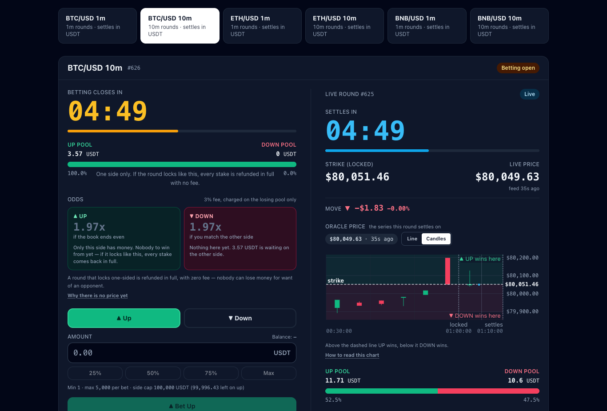

<div align="center">


# UpDown Protocol

**Non-custodial parimutuel binary options on BNB Smart Chain, settled by Chainlink price feeds.**

[](https://github.com/CisaSettle/updown-bnb/actions/workflows/ci.yml)
[](https://github.com/CisaSettle/updown-bnb/actions/workflows/pages.yml)
[](LICENSE)
[](contracts/)
[](https://updown.bluffking.ai)

[**Live app**](https://updown.bluffking.ai) · [FAQ](https://updown.bluffking.ai/#/faq) · [Changelog](https://updown.bluffking.ai/#/changelog) · [Runbook](docs/RUNBOOK.html) · [简体中文](docs/README.zh-CN.md)

</div>

---

UpDown lets a trader stake USDT on whether BTC, ETH or BNB will be **higher or lower** at the end of a fixed round. Each round is a two-sided parimutuel pool: the winning side splits the losing side's stakes pro rata, and the protocol fee is charged only on the losing pool. There is no house, no market maker and no order book. The live deployment runs on BSC testnet, where a keeper-fed relay feed stands in for Chainlink because the testnet's own feeds are too stale for 1-minute rounds; see [Live deployment](#live-deployment).

The design goal is that nothing has to be trusted that can be checked instead:

- **Deterministic settlement.** A round's price is the last feed print at or before its boundary timestamp, proved on chain against the feed's round history. Calling one second late or three minutes late gives byte-identical outcomes.
- **Permissionless crank.** `executeRound()` has no operator role. The project runs a keeper so rounds settle promptly, not because the keeper is trusted.
- **Fail into refunds, never into losses.** A tie, a one-sided book, an unusable oracle print or a missed settlement window voids the round, and every stake becomes refundable in full with zero fee.
- **No admin path to user funds.** Claims are not pausable, the price feed is immutable, ownership cannot be renounced, and the settlement asset cannot be "recovered" by anyone.

<p align="center">
  
</p>

## Contents

- [How a round works](#how-a-round-works)
- [Guarantees](#guarantees)
- [Live deployment](#live-deployment)
- [Architecture](#architecture)
- [Repository layout](#repository-layout)
- [Getting started](#getting-started)
- [Testing](#testing)
- [Deployment](#deployment)
- [Operations](#operations)
- [Security model](#security-model)
- [Contributing](#contributing)
- [License](#license)

## How a round works

A market is one `(asset, interval)` pair. Rounds, called **epochs**, sit on an immutable timestamp grid: `lockTs(e) == closeTs(e-1)`, so one `executeRound()` call closes round `e-1` and locks round `e` with the same boundary price, and there is never a gap between rounds.

```
epoch e:  startTs ──── betting open (interval) ──── lockTs ──── position held (interval) ──── closeTs
                                                      │                                          │
                                                 lockPrice                                  closePrice
                                                 (strike)                                   (settlement)
```

1. **Bet.** While betting is open, stake on UP or DOWN with `betUp(epoch, amount)` or `betDown(epoch, amount)`. The market pulls USDT via an ERC-20 allowance.
2. **Lock.** At `lockTs` the last feed print at or before that timestamp becomes the strike.
3. **Settle.** At `closeTs` the same rule gives the settlement price. UP wins if it is above the strike, DOWN wins if it is below, and an exact tie voids the round.
4. **Claim.** Winners and refund holders pull their money with `claim(epochs)`. `claimTo` pays a different address, and `setAutoClaimOptIn(true)` lets anyone push your winnings to you, paying only their own gas.

**Payout.** With `feeBps = 300` (3 %) and a hard cap of 10 %:

```
fee        = losingPool × feeBps / 10 000
rewardPool = winningPool + losingPool − fee
payout     = yourStake × rewardPool / winningPool
```

Because the fee comes only out of the losing pool, a winner is never paid less than their own stake, and nobody can lose more than they staked. Example: UP pool 100 USDT, DOWN pool 300 USDT, price closes above the strike. The fee is 9 USDT, the reward pool is 391 USDT, and a 100 USDT UP stake collects 391 USDT.

**Void reasons** surfaced by `RoundVoided(epoch, reason)`:

| Code | Reason | Meaning |
|---|---|---|
| 1 | `ORACLE` | No usable print at the boundary within `oracleMaxAge` |
| 2 | `TIE` | `closePrice == lockPrice` |
| 3 | `ONE_SIDED` | Nobody took the other side |
| 4 | `NOT_LOCKED` | The round never received a strike |
| 5 | `WINDOW` | Settlement did not happen inside `bufferSeconds` |
| 6 | `EMPTY` | No stake existed, so the round was skipped without upkeep |

## Guarantees

These properties are enforced by the contracts and pinned by tests, not only described here.

- **Settlement is a pure function of the boundary.** The caller passes a feed round id and the contract proves it is the last print at or before the boundary. Settlement is only admitted once `block.timestamp` is strictly past the boundary, so no further print can qualify and transaction ordering cannot pick the price. A market is bound for life to one aggregator phase; a print from any other phase is rejected.
- **A bad proof reverts, it does not void.** Inside the settlement window a round can only be resolved by a valid proof, so a losing bettor cannot front-run an honest call with a bogus round id to force refunds. Voiding is reserved for a genuine timeout.
- **Empty rounds need no upkeep.** The open epoch follows the time grid as a view. If nobody has bet, no keeper transaction, oracle relay or gas is required; the first bet materialises the round. Only funded risk wakes the keeper.
- **Parameters are snapshotted per round.** Fee, buffer and `oracleMaxAge` are recorded when a round starts, so an admin can never retroactively change or un-expire a live round. `oracle` and `oracleMaxAge` are immutable outright.
- **Pause is not a cancel button.** Pausing stops new bets and stops new rounds from locking. A round that has already locked still settles through the pause at its true price, and `claim` is never pausable.
- **Never under-collateralised.** `assetBalance >= outstanding + treasuryAmount` is an invariant checked by the fuzz and invariant suites. Funds always leave by pull payment, and the settlement asset is excluded from `recoverToken`.

## Live deployment

### BNB Smart Chain testnet (chain 97)

Six USDT-settled markets are live at [updown.bluffking.ai](https://updown.bluffking.ai). All eleven contracts are source-verified on [Sourcify](https://sourcify.dev) (full match, 2026-09-01); the addresses below are the ones in [`contracts/deployments/97.json`](contracts/deployments/97.json), which the keeper and the web build read at runtime.

| Contract | Address |
|---|---|
| `UpDownRegistry` | [`0xAC6039E6cB9dcAa97932284433c64ee7aaAD5270`](https://testnet.bscscan.com/address/0xAC6039E6cB9dcAa97932284433c64ee7aaAD5270) |
| BTC/USD 1m | [`0x166B7c1Fcd5a6b99f303bd5D37dCca62ABEcD4eA`](https://testnet.bscscan.com/address/0x166B7c1Fcd5a6b99f303bd5D37dCca62ABEcD4eA) |
| BTC/USD 10m | [`0xE8872d45801CC97a6202B81F7D602294f437fd07`](https://testnet.bscscan.com/address/0xE8872d45801CC97a6202B81F7D602294f437fd07) |
| ETH/USD 1m | [`0x2ff6F71D5a29E686D8Ac5ba2A8b9bc5E061502F1`](https://testnet.bscscan.com/address/0x2ff6F71D5a29E686D8Ac5ba2A8b9bc5E061502F1) |
| ETH/USD 10m | [`0x4a79c230350Ae2c2179183064d9617A317D8cD1F`](https://testnet.bscscan.com/address/0x4a79c230350Ae2c2179183064d9617A317D8cD1F) |
| BNB/USD 1m | [`0xA7FE586377863718429Ee36974DD31189422E1Ee`](https://testnet.bscscan.com/address/0xA7FE586377863718429Ee36974DD31189422E1Ee) |
| BNB/USD 10m | [`0xf24cd2b4dAB0CBbb8cE678E618D9caf775833EB8`](https://testnet.bscscan.com/address/0xf24cd2b4dAB0CBbb8cE678E618D9caf775833EB8) |
| `TestUSDT` (faucet, 18 decimals) | [`0x215F2795f3f8265c5F48a7ea73C765a97414fAD0`](https://testnet.bscscan.com/address/0x215F2795f3f8265c5F48a7ea73C765a97414fAD0) |
| `RelayAggregator` BTC/USD | [`0xaCC05721293Ac60459F26ccCCC2a5daAFfE907d8`](https://testnet.bscscan.com/address/0xaCC05721293Ac60459F26ccCCC2a5daAFfE907d8) |
| `RelayAggregator` ETH/USD | [`0x527f6099216AeC563291AdeEAbB090c7b68533C6`](https://testnet.bscscan.com/address/0x527f6099216AeC563291AdeEAbB090c7b68533C6) |
| `RelayAggregator` BNB/USD | [`0x023818a693bD515cd49Ab8246bC6c7EF5E7D7C78`](https://testnet.bscscan.com/address/0x023818a693bD515cd49Ab8246bC6c7EF5E7D7C78) |

Market parameters, as set by [`Deploy.s.sol`](contracts/script/Deploy.s.sol):

| Parameter | 1-minute markets | 10-minute markets |
|---|---|---|
| `interval` (betting phase and holding phase are each this long) | 60 s | 600 s |
| `bufferSeconds` (settlement window after the boundary) | 50 s | 300 s |
| `oracleMaxAge` (how stale the boundary print may be) | 50 s | 180 s |
| Protocol fee | 3 % of the losing pool | 3 % of the losing pool |
| Bet size | 1 to 5,000 USDT, 100,000 USDT per side | 1 to 5,000 USDT, 100,000 USDT per side |

Two testnet-only substitutions keep the deployment representative of mainnet:

- **`RelayAggregator`** stands in for Chainlink. BSC testnet's own Chainlink feeds update far too rarely (up to about 1,500 s stale) to settle a 1-minute round, so the keeper relays a real exchange spot price into a Chainlink-shaped feed with round history. Writes are restricted to the owner and one updater, and `Deploy.s.sol` refuses to deploy it on mainnet.
- **`TestUSDT`** is a faucet token with the same 18 decimals as BSC-USDT. Anyone can mint 1,000 test USDT per address per hour. Test BNB for gas comes from the [official BNB Chain faucet](https://www.bnbchain.org/en/testnet-faucet) or its Telegram bot, which the app links to; the app also offers a testnet-only in-browser demo wallet for first-time visitors.

### BNB Smart Chain mainnet (chain 56)

Not deployed. Mainnet is a deliberate, owner-gated step: it needs a funded deployer, an owner that is a Safe multisig or a Timelock rather than a single key, and a review of the tree as it stands. `Deploy.s.sol` pins the settlement asset to BSC-USDT and refuses to deploy the testnet-only contracts there. The three Chainlink feeds it would deploy against are constructor arguments to an immutable contract, so `scripts/deploy-mainnet.sh` reads each one live and refuses to broadcast unless it is fresh within the 1-minute market's 50 s budget.

| Feed | Address |
|---|---|
| BTC / USD | [`0x264990fbd0A4796A3E3d8E37C4d5F87a3aCa5Ebf`](https://bscscan.com/address/0x264990fbd0A4796A3E3d8E37C4d5F87a3aCa5Ebf) |
| ETH / USD | [`0x9ef1B8c0E4F7dc8bF5719Ea496883DC6401d5b2e`](https://bscscan.com/address/0x9ef1B8c0E4F7dc8bF5719Ea496883DC6401d5b2e) |
| BNB / USD | [`0x0567F2323251f0Aab15c8dFb1967E4e8A7D42aeE`](https://bscscan.com/address/0x0567F2323251f0Aab15c8dFb1967E4e8A7D42aeE) |

## Architecture

```
                           ┌──────────────────────────────────────────────┐
  feed (IAggregatorV3)     │ UpDownMarketERC20 · one per (asset, interval)│◄── traders: bet / claim
  · Chainlink, mainnet ───►│   rounds · bets · executeRound · claims      │◄── anyone: executeRound
  · RelayAggregator, 97    │   extends UpDownMarketBase                   │
                           └──────────────────────────────────────────────┘
         ▲                                            ▲ registered in
         │ relay(price)                    ┌──────────┴──────────┐
         │ (testnet only)                  │   UpDownRegistry    │◄── web: allMarkets()
  ┌──────┴───────┐   executeRound          │ one address the UI  │
  │   keeper/    │─────────────────────────►│ enumerates markets  │
  │ TypeScript   │                          └─────────────────────┘
  └──────────────┘
```

| Component | What it does |
|---|---|
| **Contracts** (`contracts/`) | Foundry project, Solidity 0.8.28, OpenZeppelin 5. `UpDownMarketBase` holds the round grid, betting, settlement proof and claims; `UpDownMarketERC20` binds it to a standard ERC-20; a fee-on-transfer token is rejected at bet time and rebasing tokens are unsupported. `UpDownRegistry` is an on-chain directory the UI reads. `testnet/` holds `RelayAggregator` and `TestUSDT`. |
| **Keeper** (`keeper/`) | TypeScript + viem. One worker per market fires `executeRound()` just after each boundary, with a shared transaction queue for nonce coordination, chain-clock drift checks, exponential backoff and a watchdog that re-arms lost timers. On testnet it also relays spot prices into the `RelayAggregator` feeds before each boundary. Serves `/healthz` and Prometheus `/metrics`, and exits with code 78 on a configuration error so systemd does not restart it in a loop. |
| **Watchdog and daily report** (`keeper/src/monitor.ts`, `daily-report.ts`) | Out-of-process systemd timers. The watchdog checks keeper health, market identities, gas balances and whether the market-making bot is still placing stakes, and pages via Telegram. The daily report summarises what the six markets did, read from contract views only. |
| **Web** (`web/`) | React 18, Vite 7, wagmi 2, viem, Tailwind. Static bundle, hash-routed (`#/faq`, `#/changelog`), 中文 and English, light and dark. Addresses are resolved at build time from `contracts/deployments/<chainId>.json`. Every price it shows can be re-derived from the chain: the proof panel names the feed round ids behind each strike and settlement. Includes an opt-in auto-claim toggle and a testnet-only demo wallet. |
| **Scripts** (`scripts/`) | Fresh-clone setup, mainnet deploy preflight, Sourcify verification, live feed checks, an on-chain acceptance test that plays a full round with exact integer arithmetic, and the testnet market-making bot. |

## Repository layout

| Path | Contents |
|---|---|
| `contracts/src/` | `UpDownMarketBase.sol`, `UpDownMarketERC20.sol`, `UpDownRegistry.sol`, `IAggregatorV3.sol`, `testnet/RelayAggregator.sol`, `testnet/TestUSDT.sol` |
| `contracts/script/` | `Deploy.s.sol` (whole stack, chain 56 or 97) and `Genesis.s.sol` (accept ownership and open the first round) |
| `contracts/test/` | Unit, fuzz and invariant suites; `ChainlinkFork.t.sol` plays a round against the real BSC BTC/USD aggregator on a mainnet fork |
| `contracts/deployments/` | `<chainId>.json`, written only by a real broadcast and read by the keeper and the web build |
| `keeper/src/` | Keeper, health model, metrics, price source, watchdog and daily report; `keeper/*.service` and `*.timer` are the production systemd units |
| `web/src/` | Trading UI, hooks, bilingual content, FAQ and changelog |
| `scripts/` | `setup.sh`, `deploy-mainnet.sh`, `verify-sourcify.sh`, `verify-feeds.mjs`, `onchain-acceptance.mjs`, `fund-gas.mjs`, `bet-bot.mjs` |
| `docs/` | `RUNBOOK.html`, the bilingual operations runbook |
| `.github/workflows/` | `ci.yml` (path-filtered checks per module) and `pages.yml` (builds and deploys the web app) |
| `AGENTS.md` | Working agreement for contributors and coding agents |

## Getting started

Prerequisites: **Node.js 22 or newer**, **Foundry** on `PATH` (CI pins `v1.7.1`), and git.

```bash
git clone https://github.com/CisaSettle/updown-bnb.git && cd updown-bnb
./scripts/setup.sh        # pinned forge-std and OpenZeppelin, forge build, npm ci for keeper and web
cd web && npm run dev     # http://localhost:5173, reading the live testnet deployment
```

`contracts/lib/` is not committed; `setup.sh` and CI install the same pinned versions (`forge-std v1.16.2`, `openzeppelin-contracts v5.1.0`). Environment templates live at `.env.example` (deploy and ops), `keeper/.env.example` and `web/.env.example`. All `.env*` files except the examples are gitignored.

### Contracts

```bash
cd contracts
forge build --deny warnings
forge test                            # unit + fuzz + invariant
FOUNDRY_PROFILE=ci forge test         # heavier fuzz and invariant budget
forge fmt --check
```

### Keeper

```bash
cd keeper
cp .env.example .env                  # CHAIN_ID and KEEPER_PRIVATE_KEY are required; RPC_URL defaults to the public node
npm run build && npm start            # or: node --env-file=.env dist/index.js
curl -s localhost:9464/healthz        # 200 when every market it drives is on schedule
```

The keeper validates every variable at boot and refuses to start on a bad configuration. It finds its addresses in `contracts/deployments/<CHAIN_ID>.json` unless `DEPLOYMENTS_PATH` says otherwise. The keeper key needs BNB for gas and, on testnet, must be the `updater` of the relay feeds; it holds no privilege on the markets.

### Web

```bash
cd web
npm run check:deployment              # which deployment JSON the build will use
npm run dev
npm run build                         # tsc --noEmit && vite build → dist/
```

With no configuration the app targets chain 97. `VITE_CHAIN_ID`, `VITE_RPC_URL`, `VITE_DEPLOYMENT_FILE` and `VITE_WALLETCONNECT_PROJECT_ID` are optional; set `STRICT_DEPLOYMENT=1` for any real build so a missing deployment file fails the build instead of falling back to placeholder addresses. After changing a contract ABI, run `forge build` and then `npm run sync:abi` to regenerate `web/src/abi/*.ts`.

## Testing

| Suite | Command | Covers |
|---|---|---|
| Contract units | `cd contracts && forge test` | Round grid and drift, shared boundary price, payout maths and fee-on-loser-only, every void path, claim / `claimTo` / `claimFor` / double-claim, bet limits and side caps, per-round parameter snapshots, pause and restart, admin bounds, registry, testnet contracts |
| Fuzz and invariants | same run | Winner never below principal, every round self-funded, a void refunds exactly the stakes, displayed odds match realised payout, the grid never drifts; invariants: never under-collateralised (`assetBalance >= outstanding + treasuryAmount`), no leakage, per-round value conservation, advertised payouts honoured, payout and refund mutually exclusive |
| Chainlink fork | `FORK_RPC_URL=<archive rpc> forge test --match-contract ChainlinkFork` | A full round against the real BSC BTC/USD aggregator: composite round ids, `getRoundData` on non-latest rounds, real print cadence vs `oracleMaxAge`. Skips itself when `FORK_RPC_URL` is unset |
| Keeper | `cd keeper && npm test` | Config validation, backoff, boundary and round-id selection, scheduling, health evaluation, transaction queue, watchdog and daily report. No network access |
| Web | `cd web && npm run build && npm test` | Typecheck, production build, component and content tests including a 中文 copy sweep |
| Scripts | `node --test scripts/tests/*.test.mjs` | Bet-window and gas-refill logic of the bot |
| Layout | `cd web && npm run build && npx vite preview`, then `npm run check:controls` | In a real browser, that every `aria-controls` target lands on screen at 390 px and desktop width |
| On chain | `node scripts/onchain-acceptance.mjs --chain 97 --market btcUsd1m` | Plays a full round on a live deployment and checks quoted odds, payout, fee and solvency with exact integers. Sends transactions |

CI runs the checks for each module only when that module changed, formats and builds the contracts with `--deny warnings`, and builds the web app with `STRICT_DEPLOYMENT=1`. Pushes to `main` that touch `web/` or the deployment manifests are built, tested and deployed to GitHub Pages.

## Deployment

**Testnet.** Fill in `.env` from `.env.example` (deployer key, `OWNER`, `OPERATOR`), then:

```bash
cd contracts
set -a; source ../.env; set +a                                                   # PRIVATE_KEY, OWNER, OPERATOR, OWNER_PRIVATE_KEY
forge script script/Deploy.s.sol --rpc-url $BSC_TESTNET_RPC_URL --broadcast   # writes deployments/97.json
forge script script/Genesis.s.sol --rpc-url $BSC_TESTNET_RPC_URL --broadcast  # accept ownership, genesisStart()
cd .. && ./scripts/verify-sourcify.sh 97                                         # source-verify everything
```

A dry run deliberately writes nothing, so a rehearsal can never leave the keeper or the web app pointing at addresses that do not exist. `Genesis.s.sol` is idempotent and skips markets that are already live.

**Mainnet.** `./scripts/deploy-mainnet.sh` runs a preflight (valid deployer key, chain id 56, owner is a contract, deployer funded, settlement asset is BSC-USDT with 18 decimals, all three feeds fresh, contract checks green), simulates against real chain state, and then stops for a typed confirmation before broadcasting. Ownership acceptance and `genesisStart()` are then submitted from the owner Safe. No script in this repository deploys to mainnet on its own.

## Operations

Production runs on one host under systemd; the unit files and install steps are in `keeper/`.

| Unit | Role |
|---|---|
| `updown-keeper.service` | Drives `executeRound()` and the testnet relays; `/healthz` and `/metrics` on port 9464 |
| `updown-betbot.service` | Testnet market-making bot so visitors see a real, moving book. Refuses any chain other than 97 and any key that collides with the keeper or owner |
| `updown-health-monitor.timer` | Every minute: keeper health, market identities, gas floors, board-wide betting silence; Telegram alerts with recovery notices |
| `updown-daily-report.timer` | 08:00 local: what the six markets did the previous day, from contract views |

Every unit runs as an unprivileged user with systemd hardening and reads its secrets from a `0600` env file in `/etc/updown/`. All four exit with code 78 on a configuration error, and the two long-running services are configured so systemd does not restart them for it. Recovery procedures, gas funding and the safety rules for signing keys are in the bilingual [runbook](docs/RUNBOOK.html) (open it in a browser).

## Security model

**What the owner can do:** pause the market against new risk; change the fee (up to 10 %, only for rounds that start after the call) and the bet-size limits; withdraw the accrued protocol fee; rescue a token sent to the market by mistake, never the settlement asset; hide a market from the UI through the registry; and transfer ownership in two steps.

**What nobody can do:** touch a user's principal or unclaimed winnings; block, delay or reverse a claim; cancel a round that has already locked; settle a round at a chosen price, or un-void or un-expire one; choose, override or replace the price source; or renounce ownership.

**What you still have to trust:** the price feed itself. A feed that goes silent settles the boundaries its last print still covers and voids everything after into refunds, which is the safe failure. A feed that reports a wrong price would settle a wrong outcome, and nothing on chain can tell the difference. The FAQ's [trust section](https://updown.bluffking.ai/#/faq/admin) spells this out for traders.

**Verify a settlement yourself.** Read `getRound(epoch)` on the market to get `lockTs`, `closeTs`, `lockOracleId` and `closeOracleId`, then read `getRoundData(id)` on the feed for both ids and check that each `updatedAt` is at or before its boundary and within `oracleMaxAge` of it, and that the next round id's `updatedAt` is after the boundary. The app's proof panel does exactly this in the browser, and the [FAQ walks through it](https://updown.bluffking.ai/#/faq/verify) step by step.

**Reporting.** For a vulnerability that could put funds at risk, contact the team privately on X at [@BluffKingAI](https://x.com/BluffKingAI) before opening a public issue. For anything else, open a [GitHub issue](https://github.com/CisaSettle/updown-bnb/issues) with the market address, epoch, transaction hash and the oracle round ids from the proof panel.

This is testnet software using valueless tokens. A binary option is all-or-nothing, and a short-horizon price move is close to a coin flip before fees. Nothing here is financial advice.

## Contributing

Issues and pull requests are welcome. Before you start, read [`AGENTS.md`](AGENTS.md): it is the working agreement for this repository and applies to human and AI contributors alike.

- Keep changes scoped to the requested behaviour and verify only what they touch: `forge fmt --check`, `forge build --deny warnings` and the covering test contract for contract changes; `npm run build` plus the covering Vitest specs for keeper and web changes. CI enforces the same per-module gates.
- Preserve the invariants that matter: chain-id checks, key separation, nonce coordination, deployment validation, payout and refund logic, and the gas watchdog. Secrets stay in ignored env files.
- User-visible changes may add an entry to the public changelog in `web/src/content/changelog.json`; one is not required for every commit.
- Commit messages follow `type: summary` (`feat:`, `fix:`, `docs:`, `refactor:`, `release:`).

## License

[MIT](LICENSE). Every Solidity source carries `SPDX-License-Identifier: MIT`.
