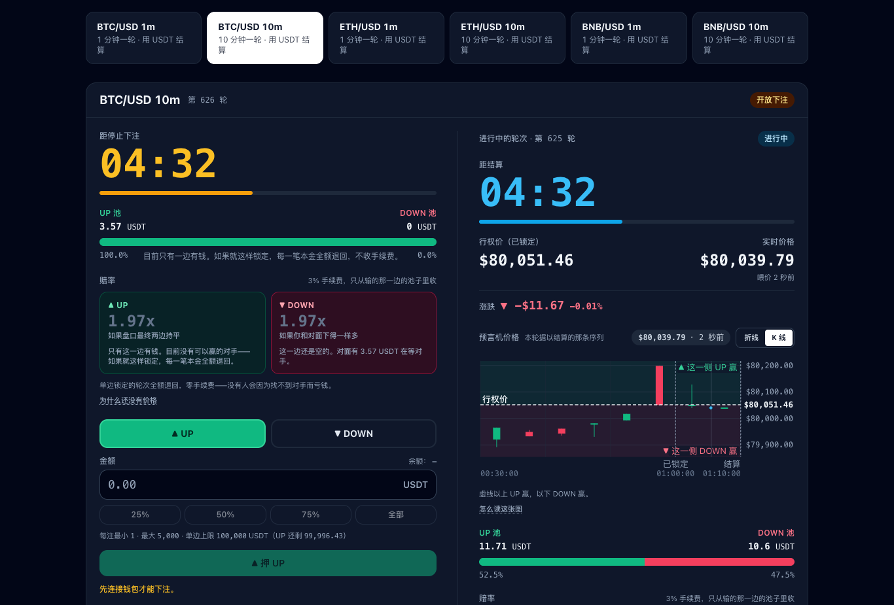

<div align="center">


# UpDown Protocol

**BNB 智能链上的非托管平价池二元期权，以 Chainlink 价格喂价结算。**

[](https://github.com/CisaSettle/updown-bnb/actions/workflows/ci.yml)
[](https://github.com/CisaSettle/updown-bnb/actions/workflows/pages.yml)
[](../LICENSE)
[](../contracts/)
[](https://updown.bluffking.ai)

[**线上应用**](https://updown.bluffking.ai) · [常见问题](https://updown.bluffking.ai/#/faq) · [更新记录](https://updown.bluffking.ai/#/changelog) · [运维手册](RUNBOOK.html) · [English](../README.md)

</div>

---

UpDown 让交易者用 USDT 预测 BTC、ETH 或 BNB 在一个固定轮次结束时会**更高还是更低**。每一轮是一个双边平价池：赢方按比例瓜分输方的本金，协议手续费只从输方池收取。没有庄家、没有做市商、没有订单簿。当前线上部署在 BSC 测试网：测试网自带的喂价太滞后，撑不住 1 分钟的轮次，所以由 keeper 推送的中继喂价代替 Chainlink，详见[线上部署](#线上部署)。

设计目标是：凡是可以验证的，就不需要信任。

- **确定性结算。** 一轮的价格是该轮边界时间戳之前（含）的最后一笔喂价，由合约对照喂价的轮次历史在链上证明。晚一秒调用和晚三分钟调用，结果逐字节相同。
- **无许可推进。** `executeRound()` 没有操作员角色。项目运行 keeper 是为了让轮次及时结算，而不是因为 keeper 被信任。
- **失败只会变成退款，不会变成损失。** 平局、单边池、边界处没有可用喂价、错过结算窗口，都会让该轮作废，每一笔本金全额可退，零手续费。
- **管理员没有任何触及用户资金的路径。** 领取不可暂停，价格喂价不可更换，所有权不可放弃，结算资产任何人都无法"救援"取走。

<p align="center">
  
</p>

## 目录

- [一轮是怎么进行的](#一轮是怎么进行的)
- [合约保证](#合约保证)
- [线上部署](#线上部署)
- [架构](#架构)
- [仓库结构](#仓库结构)
- [快速开始](#快速开始)
- [测试](#测试)
- [部署](#部署)
- [运维](#运维)
- [安全模型](#安全模型)
- [参与贡献](#参与贡献)
- [许可证](#许可证)

## 一轮是怎么进行的

一个市场就是一组 `(资产, 周期)`。轮次称为 **epoch**，落在一条不可变的时间网格上：`lockTs(e) == closeTs(e-1)`，所以一次 `executeRound()` 调用用同一个边界价格同时关闭第 `e-1` 轮并锁定第 `e` 轮，轮次之间永远没有空隙。

```
epoch e:  startTs ──── betting open (interval) ──── lockTs ──── position held (interval) ──── closeTs
                                                      │                                          │
                                                 lockPrice                                  closePrice
                                                 (strike)                                   (settlement)
```

1. **下注。** 开放下注期间，用 `betUp(epoch, amount)` 或 `betDown(epoch, amount)` 押 UP 或 DOWN。市场通过 ERC-20 授权划走 USDT。
2. **锁定。** 到 `lockTs` 时，该时间戳之前（含）的最后一笔喂价成为行权价。
3. **结算。** 到 `closeTs` 时，同样的规则给出结算价。结算价高于行权价 UP 赢，低于行权价 DOWN 赢，完全相等则该轮作废。
4. **领取。** 赢家和可退款者用 `claim(epochs)` 自行提取。`claimTo` 可以付给另一个地址；`setAutoClaimOptIn(true)` 允许任何人替你把赢利推送到你的地址，对方只付自己的 gas。

**赔付。** 以 `feeBps = 300`（3%）计，上限硬编码为 10%：

```
fee        = 输方池 × feeBps / 10 000
rewardPool = 赢方池 + 输方池 − fee
payout     = 你的本金 × rewardPool / 赢方池
```

手续费只从输方池扣，所以赢家拿到的永远不会少于自己的本金，任何人也不会输掉超过本金的钱。例：UP 池 100 USDT，DOWN 池 300 USDT，结算价高于行权价。手续费 9 USDT，奖池 391 USDT，一笔 100 USDT 的 UP 本金领到 391 USDT。

**作废原因**，通过 `RoundVoided(epoch, reason)` 事件给出：

| 代码 | 原因 | 含义 |
|---|---|---|
| 1 | `ORACLE` | 边界处 `oracleMaxAge` 内没有可用喂价 |
| 2 | `TIE` | `closePrice == lockPrice` |
| 3 | `ONE_SIDED` | 没有人押另一边 |
| 4 | `NOT_LOCKED` | 该轮从未拿到行权价 |
| 5 | `WINDOW` | 没有在 `bufferSeconds` 内完成结算 |
| 6 | `EMPTY` | 没有任何本金，该轮被直接跳过，无需维护 |

## 合约保证

以下性质由合约强制执行并被测试固定，而不只是写在这里。

- **结算价是边界的纯函数。** 调用者传入一个喂价轮次 id，合约证明它是边界之前（含）的最后一笔。只有当 `block.timestamp` 严格越过边界后才允许结算，此后不可能再有新的喂价符合条件，交易排序也就无法挑选价格。每个市场终身绑定一个聚合器相位，其他相位的喂价一律拒绝。
- **错误的证明会回滚，而不是作废。** 在结算窗口内，一轮只能用有效证明来结算，因此输家无法用伪造的轮次 id 抢跑诚实调用来逼出退款。作废只留给真正的超时。
- **空轮次不需要维护。** 当前开放的 epoch 只是时间网格上的一个视图。没有人下注，就不需要 keeper 交易、喂价中继或 gas；第一笔下注才把这一轮实体化。只有已经承担的风险才会唤醒 keeper。
- **参数按轮快照。** 手续费、缓冲时间和 `oracleMaxAge` 在轮次开始时记录，管理员永远无法追溯修改或"解除过期"一个进行中的轮次。`oracle` 和 `oracleMaxAge` 本身是不可变量。
- **暂停不是取消键。** 暂停会停止新的下注和新的锁定。已经锁定的轮次照样穿过暂停，按真实价格结算，而 `claim` 永远不可暂停。
- **永不抵押不足。** `assetBalance >= outstanding + treasuryAmount` 是模糊测试与不变量测试检查的不变量。资金只能以拉取方式离开合约，结算资产被排除在 `recoverToken` 之外。

## 线上部署

### BNB 智能链测试网（链 97）

六个以 USDT 结算的市场在 [updown.bluffking.ai](https://updown.bluffking.ai) 运行。全部十一个合约已在 [Sourcify](https://sourcify.dev) 完成源码验证（完全匹配，2026-09-01）；下面的地址来自 [`contracts/deployments/97.json`](../contracts/deployments/97.json)，keeper 和网页构建在运行时读取的就是这份文件。

| 合约 | 地址 |
|---|---|
| `UpDownRegistry` | [`0xAC6039E6cB9dcAa97932284433c64ee7aaAD5270`](https://testnet.bscscan.com/address/0xAC6039E6cB9dcAa97932284433c64ee7aaAD5270) |
| BTC/USD 1m | [`0x166B7c1Fcd5a6b99f303bd5D37dCca62ABEcD4eA`](https://testnet.bscscan.com/address/0x166B7c1Fcd5a6b99f303bd5D37dCca62ABEcD4eA) |
| BTC/USD 10m | [`0xE8872d45801CC97a6202B81F7D602294f437fd07`](https://testnet.bscscan.com/address/0xE8872d45801CC97a6202B81F7D602294f437fd07) |
| ETH/USD 1m | [`0x2ff6F71D5a29E686D8Ac5ba2A8b9bc5E061502F1`](https://testnet.bscscan.com/address/0x2ff6F71D5a29E686D8Ac5ba2A8b9bc5E061502F1) |
| ETH/USD 10m | [`0x4a79c230350Ae2c2179183064d9617A317D8cD1F`](https://testnet.bscscan.com/address/0x4a79c230350Ae2c2179183064d9617A317D8cD1F) |
| BNB/USD 1m | [`0xA7FE586377863718429Ee36974DD31189422E1Ee`](https://testnet.bscscan.com/address/0xA7FE586377863718429Ee36974DD31189422E1Ee) |
| BNB/USD 10m | [`0xf24cd2b4dAB0CBbb8cE678E618D9caf775833EB8`](https://testnet.bscscan.com/address/0xf24cd2b4dAB0CBbb8cE678E618D9caf775833EB8) |
| `TestUSDT`（水龙头，18 位小数） | [`0x215F2795f3f8265c5F48a7ea73C765a97414fAD0`](https://testnet.bscscan.com/address/0x215F2795f3f8265c5F48a7ea73C765a97414fAD0) |
| `RelayAggregator` BTC/USD | [`0xaCC05721293Ac60459F26ccCCC2a5daAFfE907d8`](https://testnet.bscscan.com/address/0xaCC05721293Ac60459F26ccCCC2a5daAFfE907d8) |
| `RelayAggregator` ETH/USD | [`0x527f6099216AeC563291AdeEAbB090c7b68533C6`](https://testnet.bscscan.com/address/0x527f6099216AeC563291AdeEAbB090c7b68533C6) |
| `RelayAggregator` BNB/USD | [`0x023818a693bD515cd49Ab8246bC6c7EF5E7D7C78`](https://testnet.bscscan.com/address/0x023818a693bD515cd49Ab8246bC6c7EF5E7D7C78) |

市场参数，由 [`Deploy.s.sol`](../contracts/script/Deploy.s.sol) 设定：

| 参数 | 1 分钟市场 | 10 分钟市场 |
|---|---|---|
| `interval`（下注阶段和持仓阶段各为此长度） | 60 秒 | 600 秒 |
| `bufferSeconds`（边界之后的结算窗口） | 50 秒 | 300 秒 |
| `oracleMaxAge`（边界喂价允许的最大滞后） | 50 秒 | 180 秒 |
| 协议手续费 | 输方池的 3% | 输方池的 3% |
| 单注额度 | 1 到 5,000 USDT，每边上限 100,000 USDT | 1 到 5,000 USDT，每边上限 100,000 USDT |

两个仅限测试网的替代品让这套部署尽量贴近主网：

- **`RelayAggregator`** 替代 Chainlink。BSC 测试网自带的 Chainlink 喂价更新太慢（最多滞后约 1,500 秒），撑不住 1 分钟的轮次，所以 keeper 把真实交易所的现货价中继到一个带轮次历史、Chainlink 形状的喂价合约里。写入只允许 owner 和一个 updater，`Deploy.s.sol` 拒绝在主网部署它。
- **`TestUSDT`** 是水龙头代币，和 BSC-USDT 一样是 18 位小数。任何地址每小时可以领 1,000 测试 USDT。用作 gas 的测试 BNB 来自[官方 BNB Chain 水龙头](https://www.bnbchain.org/en/testnet-faucet)或其 Telegram 机器人（应用里有链接）；应用还为首次访问者提供仅限测试网的浏览器内演示钱包。

### BNB 智能链主网（链 56）

尚未部署。主网是一个刻意独立、需要 owner 授权的步骤：需要一个有资金的部署账户、一个由 Safe 多签或 Timelock 而非单一私钥担任的 owner，以及对当前代码树的审查。`Deploy.s.sol` 把结算资产固定为 BSC-USDT，并拒绝在主网部署仅限测试网的合约。它要对接的三个 Chainlink 喂价是不可变合约的构造参数，所以 `scripts/deploy-mainnet.sh` 会逐个在线读取，除非每个喂价都在 1 分钟市场 50 秒的预算内更新过，否则拒绝广播。

| 喂价 | 地址 |
|---|---|
| BTC / USD | [`0x264990fbd0A4796A3E3d8E37C4d5F87a3aCa5Ebf`](https://bscscan.com/address/0x264990fbd0A4796A3E3d8E37C4d5F87a3aCa5Ebf) |
| ETH / USD | [`0x9ef1B8c0E4F7dc8bF5719Ea496883DC6401d5b2e`](https://bscscan.com/address/0x9ef1B8c0E4F7dc8bF5719Ea496883DC6401d5b2e) |
| BNB / USD | [`0x0567F2323251f0Aab15c8dFb1967E4e8A7D42aeE`](https://bscscan.com/address/0x0567F2323251f0Aab15c8dFb1967E4e8A7D42aeE) |

## 架构

```
                           ┌──────────────────────────────────────────────┐
  feed (IAggregatorV3)     │ UpDownMarketERC20 · one per (asset, interval)│◄── traders: bet / claim
  · Chainlink, mainnet ───►│   rounds · bets · executeRound · claims      │◄── anyone: executeRound
  · RelayAggregator, 97    │   extends UpDownMarketBase                   │
                           └──────────────────────────────────────────────┘
         ▲                                            ▲ registered in
         │ relay(price)                    ┌──────────┴──────────┐
         │ (testnet only)                  │   UpDownRegistry    │◄── web: allMarkets()
  ┌──────┴───────┐   executeRound          │ one address the UI  │
  │   keeper/    │─────────────────────────►│ enumerates markets  │
  │ TypeScript   │                          └─────────────────────┘
  └──────────────┘
```

| 组件 | 职责 |
|---|---|
| **合约**（`contracts/`） | Foundry 项目，Solidity 0.8.28，OpenZeppelin 5。`UpDownMarketBase` 承载时间网格、下注、结算证明与领取；`UpDownMarketERC20` 把它绑定到标准 ERC-20：转账扣费代币在下注时即被拒绝，rebase 代币不受支持。`UpDownRegistry` 是前端读取的链上市场目录。`testnet/` 下是 `RelayAggregator` 和 `TestUSDT`。 |
| **Keeper**（`keeper/`） | TypeScript + viem。每个市场一个 worker，在每个边界之后立刻发出 `executeRound()`，共享一条交易队列协调 nonce，检查链上时钟漂移，指数退避，并有看门狗重新装载丢失的定时器。测试网上还会在每个边界前把现货价中继进 `RelayAggregator`。提供 `/healthz` 和 Prometheus 格式的 `/metrics`；配置错误时以退出码 78 结束，systemd 不会反复重启它。 |
| **看门狗与日报**（`keeper/src/monitor.ts`、`daily-report.ts`） | 进程外的 systemd 定时任务。看门狗检查 keeper 健康、市场身份、gas 余额以及做市机器人是否还在下注，通过 Telegram 告警。日报只从合约视图读取数据，汇总六个市场前一天的情况。 |
| **网页**（`web/`） | React 18、Vite 7、wagmi 2、viem、Tailwind。静态打包，hash 路由（`#/faq`、`#/changelog`），中英双语，明暗主题。地址在构建时从 `contracts/deployments/<chainId>.json` 解析。页面上每一个价格都能从链上重新推导：证明面板会列出每个行权价和结算价背后的喂价轮次 id。包含可选的自动领取开关和仅限测试网的演示钱包。 |
| **脚本**（`scripts/`） | 全新克隆初始化、主网部署预检、Sourcify 验证、在线喂价检查、用精确整数运算完整跑一轮的链上验收测试，以及测试网做市机器人。 |

## 仓库结构

| 路径 | 内容 |
|---|---|
| `contracts/src/` | `UpDownMarketBase.sol`、`UpDownMarketERC20.sol`、`UpDownRegistry.sol`、`IAggregatorV3.sol`、`testnet/RelayAggregator.sol`、`testnet/TestUSDT.sol` |
| `contracts/script/` | `Deploy.s.sol`（整套部署，链 56 或 97）和 `Genesis.s.sol`（接受所有权并开出第一轮） |
| `contracts/test/` | 单元、模糊与不变量测试；`ChainlinkFork.t.sol` 在主网 fork 上对着真实的 BSC BTC/USD 聚合器跑完整一轮 |
| `contracts/deployments/` | `<chainId>.json`，只由真实广播写入，keeper 和网页构建读取 |
| `keeper/src/` | Keeper、健康模型、指标、价格源、看门狗与日报；`keeper/*.service` 和 `*.timer` 是生产环境的 systemd 单元 |
| `web/src/` | 交易界面、hooks、双语文案、常见问题与更新记录 |
| `scripts/` | `setup.sh`、`deploy-mainnet.sh`、`verify-sourcify.sh`、`verify-feeds.mjs`、`onchain-acceptance.mjs`、`fund-gas.mjs`、`bet-bot.mjs` |
| `docs/` | `RUNBOOK.html`，双语运维手册 |
| `.github/workflows/` | `ci.yml`（按模块路径过滤的检查）和 `pages.yml`（构建并发布网页） |
| `AGENTS.md` | 面向贡献者和编码代理的工作约定 |

## 快速开始

前置条件：**Node.js 22 或更新**、`PATH` 上有 **Foundry**（CI 固定 `v1.7.1`）、git。

```bash
git clone https://github.com/CisaSettle/updown-bnb.git && cd updown-bnb
./scripts/setup.sh        # 固定版本的 forge-std 与 OpenZeppelin，forge build，keeper 和 web 的 npm ci
cd web && npm run dev     # http://localhost:5173，读取线上测试网部署
```

`contracts/lib/` 不提交到仓库；`setup.sh` 和 CI 安装同样固定的版本（`forge-std v1.16.2`、`openzeppelin-contracts v5.1.0`）。环境变量模板在 `.env.example`（部署与运维）、`keeper/.env.example` 和 `web/.env.example`。除模板外的所有 `.env*` 文件都被 gitignore。

### 合约

```bash
cd contracts
forge build --deny warnings
forge test                            # 单元 + 模糊 + 不变量
FOUNDRY_PROFILE=ci forge test         # 更大的模糊与不变量预算
forge fmt --check
```

### Keeper

```bash
cd keeper
cp .env.example .env                  # CHAIN_ID 与 KEEPER_PRIVATE_KEY 必填；RPC_URL 默认用公共节点
npm run build && npm start            # 或：node --env-file=.env dist/index.js
curl -s localhost:9464/healthz        # 它负责的每个市场都按时推进时返回 200
```

Keeper 在启动时校验每一个变量，配置有误就拒绝启动。除非 `DEPLOYMENTS_PATH` 另行指定，它从 `contracts/deployments/<CHAIN_ID>.json` 读取地址。Keeper 私钥只需要 BNB 付 gas，在测试网上还必须是中继喂价的 `updater`；它对市场本身没有任何特权。

### 网页

```bash
cd web
npm run check:deployment              # 打印构建会使用哪份部署文件
npm run dev
npm run build                         # tsc --noEmit && vite build → dist/
```

不做任何配置时应用指向链 97。`VITE_CHAIN_ID`、`VITE_RPC_URL`、`VITE_DEPLOYMENT_FILE` 和 `VITE_WALLETCONNECT_PROJECT_ID` 都是可选项；任何正式构建都应设置 `STRICT_DEPLOYMENT=1`，让缺失的部署文件直接导致构建失败，而不是回退到占位地址。修改合约 ABI 之后，先 `forge build`，再 `npm run sync:abi` 重新生成 `web/src/abi/*.ts`。

## 测试

| 套件 | 命令 | 覆盖内容 |
|---|---|---|
| 合约单元测试 | `cd contracts && forge test` | 时间网格与漂移、共享边界价格、赔付计算与只对输方收费、每一条作废路径、`claim` / `claimTo` / `claimFor` / 重复领取、单注与单边上限、按轮参数快照、暂停与恢复、管理员参数边界、注册表、测试网合约 |
| 模糊与不变量 | 同一次运行 | 赢家永不低于本金、每轮自我兑付、作废退款恰好等于本金、显示赔率等于实际赔付、网格永不漂移；不变量：永不抵押不足（`assetBalance >= outstanding + treasuryAmount`）、无资金泄漏、每轮价值守恒、公示赔付必兑现、赔付与退款互斥 |
| Chainlink fork | `FORK_RPC_URL=<归档节点> forge test --match-contract ChainlinkFork` | 对着真实的 BSC BTC/USD 聚合器跑完整一轮：复合轮次 id、非最新轮次的 `getRoundData`、真实喂价节奏与 `oracleMaxAge` 的关系。未设置 `FORK_RPC_URL` 时自动跳过 |
| Keeper | `cd keeper && npm test` | 配置校验、退避、边界与轮次 id 选择、调度、健康评估、交易队列、看门狗与日报。不访问网络 |
| 网页 | `cd web && npm run build && npm test` | 类型检查、生产构建、组件与文案测试（含中文文案扫描） |
| 脚本 | `node --test scripts/tests/*.test.mjs` | 机器人的下注窗口与 gas 补充逻辑 |
| 布局 | `cd web && npm run build && npx vite preview`，然后 `npm run check:controls` | 在真实浏览器里检查每个 `aria-controls` 目标在 390 px 和桌面宽度下都落在屏幕内 |
| 链上 | `node scripts/onchain-acceptance.mjs --chain 97 --market btcUsd1m` | 在线上部署完整跑一轮，用精确整数核对报价赔率、赔付、手续费与偿付能力。会发送交易 |

CI 只在某个模块有改动时运行该模块的检查，合约用 `--deny warnings` 做格式检查与构建，网页以 `STRICT_DEPLOYMENT=1` 构建。推送到 `main` 且触及 `web/` 或部署清单的提交会被构建、测试并发布到 GitHub Pages。

## 部署

**测试网。** 按 `.env.example` 填好 `.env`（部署私钥、`OWNER`、`OPERATOR`），然后：

```bash
cd contracts
set -a; source ../.env; set +a                                                   # PRIVATE_KEY、OWNER、OPERATOR、OWNER_PRIVATE_KEY
forge script script/Deploy.s.sol --rpc-url $BSC_TESTNET_RPC_URL --broadcast   # 写入 deployments/97.json
forge script script/Genesis.s.sol --rpc-url $BSC_TESTNET_RPC_URL --broadcast  # 接受所有权，genesisStart()
cd .. && ./scripts/verify-sourcify.sh 97                                         # 全部源码验证
```

干跑（dry run）刻意不写任何文件，所以一次演练绝不会让 keeper 或网页指向不存在的地址。`Genesis.s.sol` 是幂等的，会跳过已经开始的市场。

**主网。** `./scripts/deploy-mainnet.sh` 先做预检（部署私钥有效、链 id 为 56、owner 是合约、部署账户有余额、结算资产是 18 位小数的 BSC-USDT、三个喂价都是新鲜的、合约检查通过），再对着真实链状态模拟，然后停下来等待手动输入确认才广播。接受所有权和 `genesisStart()` 之后由 owner 的 Safe 提交。仓库里没有任何脚本会自行部署到主网。

## 运维

生产环境在一台主机上以 systemd 运行；单元文件和安装步骤在 `keeper/` 目录。

| 单元 | 职责 |
|---|---|
| `updown-keeper.service` | 驱动 `executeRound()` 与测试网中继；`/healthz` 和 `/metrics` 在 9464 端口 |
| `updown-betbot.service` | 测试网做市机器人，让访客看到真实、会动的盘口。拒绝 97 以外的任何链，拒绝与 keeper 或 owner 冲突的私钥 |
| `updown-health-monitor.timer` | 每分钟：keeper 健康、市场身份、gas 下限、全盘下注静默；Telegram 告警并附恢复通知 |
| `updown-daily-report.timer` | 本地时间 08:00：从合约视图汇总六个市场前一天的情况 |

每个单元都以非特权用户运行并启用 systemd 加固，从 `/etc/updown/` 下权限为 `0600` 的 env 文件读取密钥。四个单元遇到配置错误都以退出码 78 结束，两个常驻服务还配置了 systemd 不因此重启。恢复流程、gas 补充和签名私钥的安全规则见双语[运维手册](RUNBOOK.html)（用浏览器打开）。

## 安全模型

**owner 能做的：** 暂停市场、停止承担新风险；修改手续费（上限 10%，只对调用之后开始的轮次生效）和单注额度；提取累计的协议手续费；取回误转进市场合约的代币，但永远取不走结算资产；通过注册表把某个市场从前端隐藏；分两步移交所有权。

**没有人能做的：** 动用用户的本金或未领取的赢利；阻止、拖延或撤销一次领取；取消已经锁定的轮次；按自选价格结算某一轮，或撤销作废、撤销过期；选择、覆盖或更换价格来源；放弃所有权。

**你仍然需要信任的：** 价格喂价本身。喂价停止更新时，它最后一笔喂价还能覆盖的边界照常结算，之后的全部作废退款，这是安全的失败方式。但喂价报出错误价格时，会结算出错误的结果，链上没有任何东西能分辨。常见问题里的[信任章节](https://updown.bluffking.ai/#/faq/admin)面向交易者把这一点讲清楚了。

**自己验证一次结算。** 在市场合约上读 `getRound(epoch)` 得到 `lockTs`、`closeTs`、`lockOracleId` 和 `closeOracleId`，再在喂价合约上对这两个 id 各读一次 `getRoundData(id)`，核对每个 `updatedAt` 都不晚于对应边界且与边界相距不超过 `oracleMaxAge`，而下一个轮次 id 的 `updatedAt` 晚于边界。应用的证明面板在浏览器里做的正是这件事，[常见问题](https://updown.bluffking.ai/#/faq/verify)有逐步说明。

**报告问题。** 可能危及资金的漏洞，请先通过 X 私信 [@BluffKingAI](https://x.com/BluffKingAI)，再考虑公开 issue。其他问题请开 [GitHub issue](https://github.com/CisaSettle/updown-bnb/issues)，附上市场地址、轮次、交易哈希以及证明面板里的喂价轮次 id。

这是使用无价值代币的测试网软件。二元期权是全有或全无的，短周期价格变动在扣费前接近抛硬币。这里没有任何内容构成投资建议。

## 参与贡献

欢迎提交 issue 和 pull request。开始之前请阅读 [`AGENTS.md`](../AGENTS.md)：它是这个仓库的工作约定，对人类和 AI 贡献者同样适用。

- 改动只覆盖被要求的行为，验证也只覆盖被触及的部分：合约改动跑 `forge fmt --check`、`forge build --deny warnings` 和对应的测试合约；keeper 和网页改动跑 `npm run build` 加对应的 Vitest 规格。CI 按模块执行同样的门禁。
- 保留那些关键的不变量：链 id 检查、私钥隔离、nonce 协调、部署校验、赔付与退款逻辑、gas 看门狗。密钥只放在被忽略的 env 文件里。
- 用户可感知的改动可以在 `web/src/content/changelog.json` 的公开更新记录里加一条；不要求每次提交都写。
- 提交信息遵循 `type: summary`（`feat:`、`fix:`、`docs:`、`refactor:`、`release:`）。

## 许可证

[MIT](../LICENSE)。每个 Solidity 源文件都带有 `SPDX-License-Identifier: MIT`。
